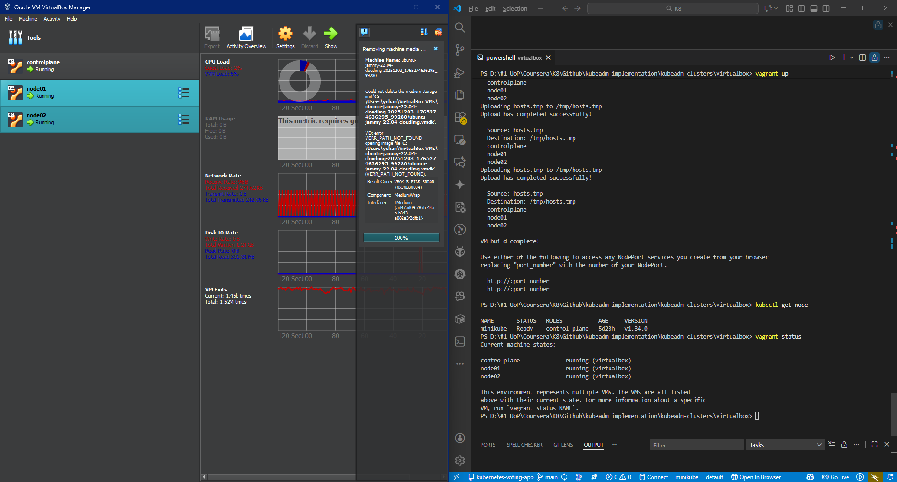
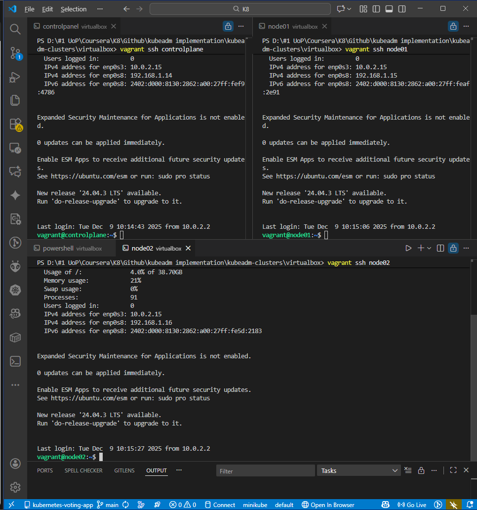
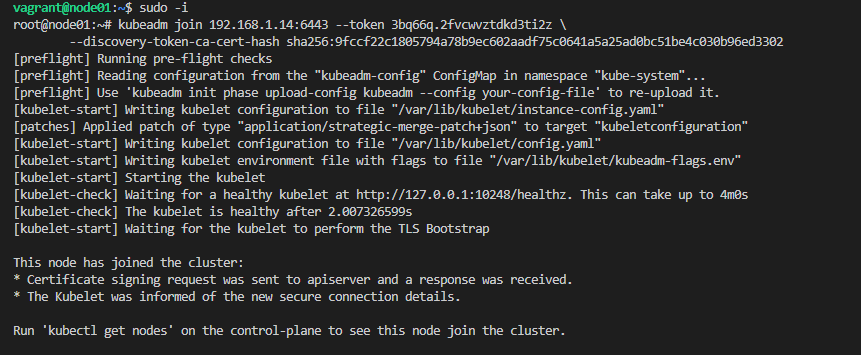
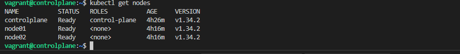
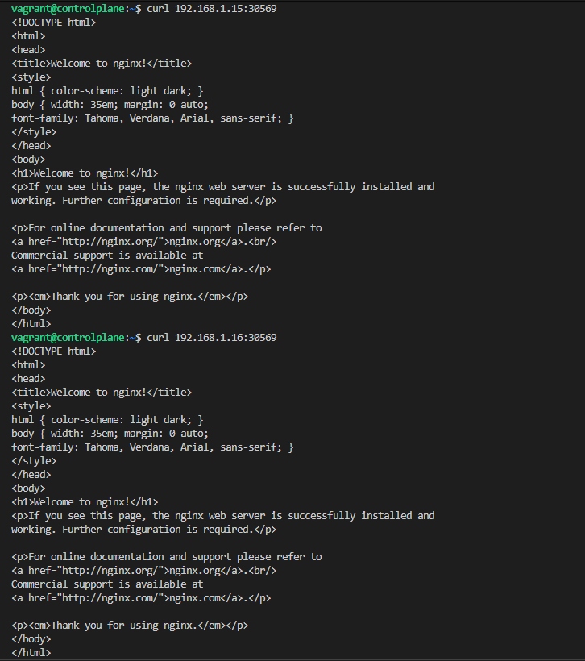
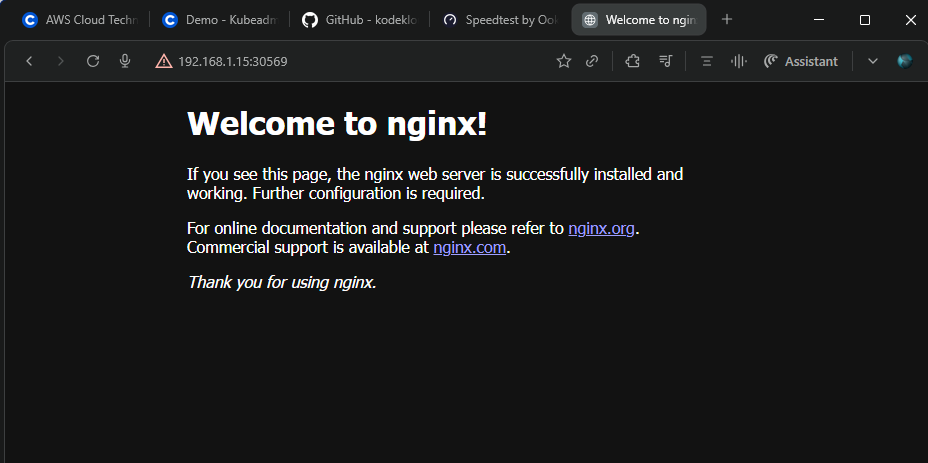
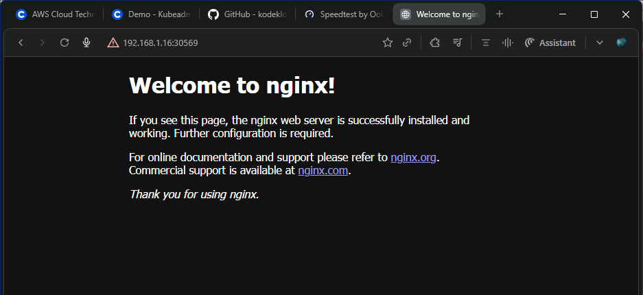

# Kubeadm Kubernetes Cluster Setup

## Project Overview

This repository is forked from the KodeKloud [Kubernetes Course repository](https://github.com/kodekloudhub/certified-kubernetes-administrator-course) and used as a **personal hands-on lab** to experiment with building a **real multi-node Kubernetes cluster using kubeadm**. Instead of relying on managed platforms or single-node tools like Minikube, this project uses **Vagrant** to provision **multiple Ubuntu virtual machines** and form a full Kubernetes cluster from scratch.

## Goals

-   Practice full **bare-metal style Kubernetes installation**
    
-   Learn **kubeadm cluster bootstrapping**
    
-   Understand **container runtime configuration**
    
-   Set up real **cluster networking using Calico**
    
-   Join worker nodes and validate traffic routing
    
-   Deploy test workloads and expose services
    

* * *

## 🧱 Cluster Architecture

                       ┌────────────────────┐
                       │   Control Plane    │
                       │   (controlplane)   │
                       └─────────┬──────────┘
                                 │
              ┌──────────────────┴──────────────────┐
              │                                     │
        ┌─────┴─────┐                         ┌─────┴─────┐
        │  Worker   │                         │  Worker   │
        │  Node 01  │                         │  Node 02  │
        └───────────┘                         └───────────┘
    

Traffic flows through a **NodePort Service** exposed on all nodes. This diagram shows how the master node manages the two worker nodes.

* * *

## 🖥️ Environment Setup

## Tools Used

| **Tool** | **Purpose** |
| --- | --- |
| Vagrant | Creates the virtual machines automatically. |
| VirtualBox | The actual software that runs the VMs. |
| Ubuntu | The operating system used for the nodes. |
| kubeadm | The official tool to build the cluster. |
| containerd | The software that actually runs the containers. |
| Calico | Handles networking so Pods can talk to each other. |

* * *

## 🚀 Provision Virtual Machines

## Spin up the 3-node environment

This command reads the `Vagrantfile` and builds the three virtual machines on the computer.

`vagrant up`

  
   
  <b>VM Build with Vagrant</b>

* * *

## 🔑 SSH Into Nodes

Open three terminals and connect. This logs you into the command line of each specific virtual machine.

`vagrant ssh controlplane` &nbsp;
`vagrant ssh node01` &nbsp;
`vagrant ssh node02`

  
   
  <b>SSH Into All Nodes</b>

* * *

## ⚙️ Configure Kubernetes Prerequisites

_(Run on **all** nodes: controlplane, node01, node02)_

## System dependencies

Updates the OS list and installs tools needed to download software securely.

`sudo apt-get update`   `sudo apt-get install -y apt-transport-https ca-certificates curl`

## Kernel modules

Loads specific Linux kernel parts required for container networking to work.

`cat <<EOF | sudo tee /etc/modules-load.d/k8s.conf overlay br_netfilter EOF sudo modprobe overlay sudo modprobe br_netfilter`

## Sysctl rules

Updates network settings to ensure traffic passes correctly across network bridges.

`cat <<EOF | sudo tee /etc/sysctl.d/k8s.conf net.bridge.bridge-nf-call-iptables = 1 net.bridge.bridge-nf-call-ip6tables = 1 net.ipv4.ip_forward = 1 EOF sudo sysctl --system`

## Install containerd

Installs the container runtime responsible for running the container processes.

`sudo apt-get install -y containerd`

## Enable systemd cgroups for containerd

Configures the runtime to work correctly with Linux's system manager (systemd).

`sudo mkdir -p /etc/containerd containerd config default \ | sed 's/SystemdCgroup = false/SystemdCgroup = true/' \ | sudo tee /etc/containerd/config.toml sudo systemctl restart containerd`

* * *

## 📦 Install Kubernetes Components

_(Run on **all** nodes)_

## Detect latest Kubernetes version (major.minor)

Automatically finds the newest stable version number of Kubernetes.

`KUBE_LATEST=$(curl -sL https://dl.k8s.io/release/stable.txt \ | awk 'BEGIN{FS="."}{printf "%s.%s",$1,$2}')`

## Add signing keys and Kubernetes apt repository

Verifies the authenticity of the Kubernetes packages and adds the download location.

`sudo mkdir -p /etc/apt/keyrings curl -fsSL https://pkgs.k8s.io/core:/stable:/${KUBE_LATEST}/deb/Release.key \ | sudo gpg --dearmor -o /etc/apt/keyrings/kubernetes-apt-keyring.gpg echo "deb [signed-by=/etc/apt/keyrings/kubernetes-apt-keyring.gpg] \ https://pkgs.k8s.io/core:/stable:/${KUBE_LATEST}/deb/ /" \ | sudo tee /etc/apt/sources.list.d/kubernetes.list`

## Install kubelet, kubeadm, kubectl

Installs the node agent, the cluster builder, and the command-line tool.

`sudo apt-get update sudo apt-get install -y kubelet kubeadm kubectl sudo apt-mark hold kubelet kubeadm kubectl`

## Configure CRI for containerd

Tells the system specifically where to find the container runtime socket.

`sudo crictl config \ --set runtime-endpoint=unix:///run/containerd/containerd.sock \ --set image-endpoint=unix:///run/containerd/containerd.sock`

## Set kubelet node IP

Ensures the node uses the correct IP address for internal cluster communication. Make sure `PRIMARY_IP` is set appropriately on each node first.

`cat <<EOF | sudo tee /etc/default/kubelet KUBELET_EXTRA_ARGS='--node-ip ${PRIMARY_IP}' EOF`

* * *

## 🚦 Initialize Control Plane

_(Run on **controlplane** only)_

## Network CIDRs

Sets the IP ranges for Pods and Services.

`POD_CIDR=10.244.0.0/16 SERVICE_CIDR=10.96.0.0/16`

## Bootstrap the cluster

Starts the master node components (API server, scheduler, etc.).

`sudo kubeadm init \ --pod-network-cidr $POD_CIDR \ --service-cidr $SERVICE_CIDR \ --apiserver-advertise-address $PRIMARY_IP`

✅ **Save the `kubeadm join` command printed at the end of this step.**

## Configure kubeconfig for the regular user

Gives your local user permission to run `kubectl` commands.

`mkdir ~/.kube sudo cp /etc/kubernetes/admin.conf ~/.kube/config sudo chown $(id -u):$(id -g) ~/.kube/config chmod 600 ~/.kube/config`

* * *

## 🌐 Install Calico CNI

_(Run on **controlplane**)_

Installs the operator that manages the network plugin.

`kubectl create -f \ https://raw.githubusercontent.com/projectcalico/calico/v3.30.1/manifests/tigera-operator.yaml`

Applies the custom network configuration so Pods can communicate.

`curl -LO \ https://raw.githubusercontent.com/projectcalico/calico/v3.30.1/manifests/custom-resources.yaml sed -i "s#192.168.0.0/16#$POD_CIDR#" custom-resources.yaml kubectl apply -f custom-resources.yaml`

Monitor Calico status:

`watch kubectl get tigerastatus`

Wait until all values show `AVAILABLE=True`.

* * *

## 🔗 Join Worker Nodes

_(Run on **node01** and **node02**)_

Connects the worker machines to the master node to form the full cluster.

`sudo -i kubeadm join <controlplane-IP>:6443 \ --token <TOKEN> \ --discovery-token-ca-cert-hash sha256:<HASH>`

  
   
  <b>Worker Nodes Joined</b>

* * *

## ✅ Verify Cluster

Checks if all nodes are listed and in the "Ready" state.

`kubectl get nodes`

  
   
  <b>All Kubernetes Nodes Ready</b>

* * *

## 🧪 Test Deployment

## Create Nginx deployment and NodePort service

Launches a web server and exposes it on a port accessible from outside the cluster.

`kubectl create deployment nginx --image nginx:alpine kubectl expose deployment nginx --type=NodePort --port 80`

## Get service NodePort

Finds the specific port number that was opened on the nodes.

`PORT_NUMBER=$(kubectl get service -l app=nginx -o jsonpath='{.items[0].spec.ports[0].nodePort}') echo $PORT_NUMBER`

## Curl tests from worker nodes

Tests if the web server responds to requests from the command line.

`curl http://node01:$PORT_NUMBER curl http://node02:$PORT_NUMBER`

  
   
  <b>Curl Validation</b>

* * *

## 🌍 Browser Verification

Open in a browser to visually confirm the web server is running.

`http://<NODE-IP>:<NODE-PORT>`

**Node01**

  
   
  <b>Browser Access - Node01</b>

  
   
  <b>Browser Access - Node02</b>

* * *

## ✅ Final Result

-   ✅ 3-node Kubernetes cluster built with kubeadm
    
-   ✅ containerd with systemd cgroups enabled
    
-   ✅ Calico CNI installed and operational
    
-   ✅ Worker nodes joined and healthy
    
-   ✅ NodePort services accessible across nodes
    
-   ✅ Browser and curl tests successful
    

* * *

## 📚 References

-   Kubernetes Docs – [_https://kubernetes.io/docs/home/_](https://kubernetes.io/docs/home/)
    
-   Coursera – [_Kubernetes for Absolute Beginners_](https://www.coursera.org/learn/kubernetes-for-absolute-beginners/home/welcome)
    
-   KodeKloud CKA Course Materials
